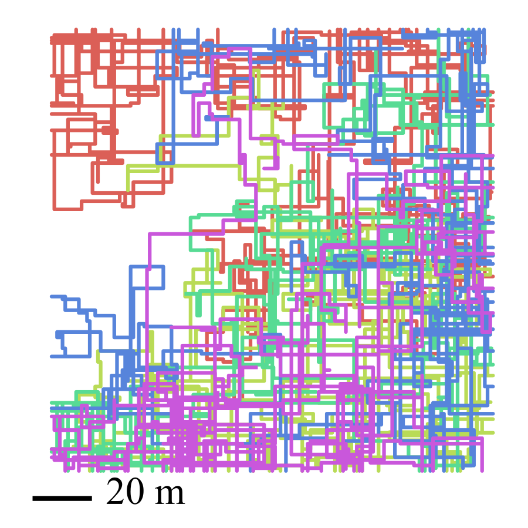
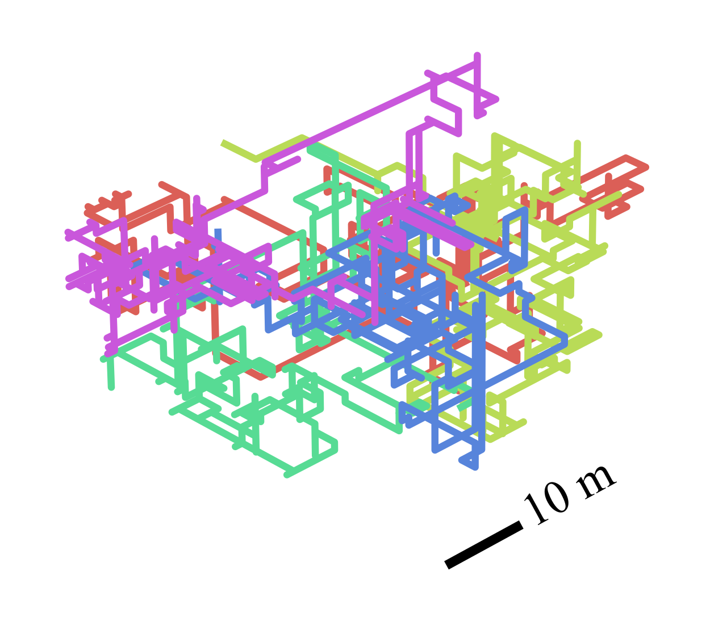
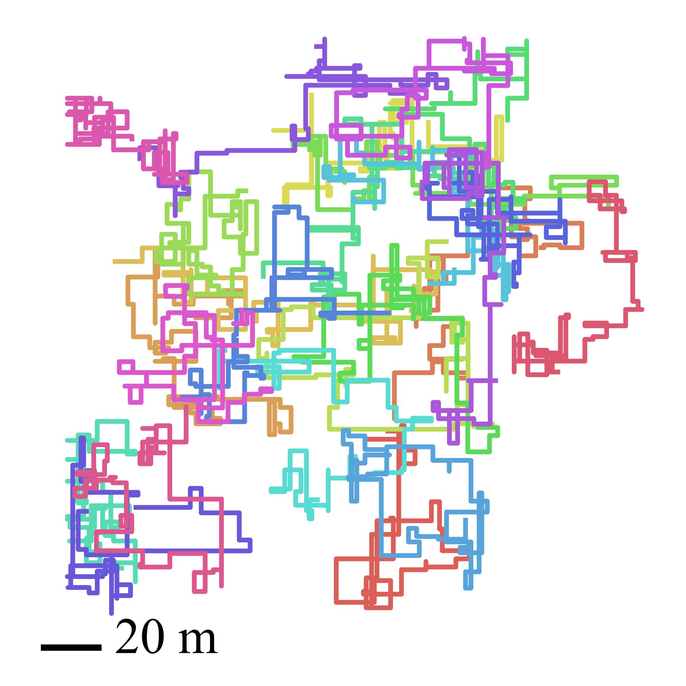

# JSON Robot Log
   

This package defines and provides c++/python support for the JSON Robot Log (JRL) file format. The file format's purpose is to provide a general purpose format for SLAM back-end datasets.

JRL format seeks to improve existing file formats like `g2o`, or the much less popular `toro` by supporting...
- Explicit temporal information to evaluate real-time performance
- Multi-robot datasets
- Explicit ground-truth (and in the same file so it cannot get lost)
- Explicit encoding of outlier/inlier measurements
- (Optionally) Initialization(s) values for batch methods

In support of this dataset format we further define a file format for solutions to the SLAM problem (JSON Robot Results (JRR)) and a file format for metrics computed on such a solution (JSON Robot Metrics (JRM)).

Combined, these formats support defining and distributing datasets for SLAM back-end algorithms as well as storing results from these optimization algorithm.  

This package also defines a library that's purpose is to make working with JRL in C++ / Python easy and convenient. It provides classes to contain information from Dataset, Result, and Metric Files as well as functionality to compute, serialize, and parse these files. While we provide support for only C++ and Python in this library, the JRL format itself is based on the generic JSON standard and can be used (with some extra work) with any language/development environment. For more info on the library itself see `LIBRARY.md`.

## Structure
The project is structured as follows
* `format/` - Contains the format definition of JRL, JRR, and JRM files
* `include/` + `src/` - Contain the C++ implementation of our convenience library. 
    * Additional documentation can be found in `Library.md`
* `python/` - Contains the definitions for python wrappers of our C++ library
* `test/` - Contains unit tests for our library
* `thirdparty/` - Contains thirdparty code (included via git submodules) namely pybind11

## Format Design Decisions / Conventions

#### JSON
JRL is defined around the JSON standard to provide a platform agnostic dataset format. Unlike a specialized formats like ROS-bags JSON files are simple text files that can be read by any platform, and most (if not all) modern programming languages provide support (potentially through libraries) for JSON parsing to make it easy to read and work with JRL datasets in your preferred development environment.

#### Symbols
We seek to abide by the GTSAM symbol convention for ease of use with GTSAM as a backend. This, however limits us as GTSAM Symbols allow for only a single character making it impossible to encode both a robot identifier and semantic variable type identifier. By convention JRL uses the symbol as a robot identifier, and differentiates variable types by partitioning the integer space of the key.

* Variable Type
    * Pose (Point2/3 or Pose2/2 depending on linearity of problem) : `0 - 999,999,999` (`0-Billions`)
    * Landmark (Point2/3) : `1,000,000,000` - `1,999,999,999` (`1-Billions`)
    * Linear Velocities (Vector): `2-Billions`
    * Angular Velocities (Vector): `3-Billions`
    * IMU Bias Terms: `4-Billions`
    * ... TODO

Note one billion was selected as the partition size arbitrarily, but we figured it would be pretty unlikely to have a single dataset with over a BILLION poses, or landmarks etc. Additionally, even with this partition size as gtsam uses a `uint64_t` it still allows for `18446744073` unique variable types which is more than enough for any practical use. 

#### Entries
JRL datasets are broken down by entries. These entries can correspond to timesteps from field operations or timesteps in simulations. Whether associated with real-time timestamps or not what is important is that entries allow for the user to explicitly encode when measurements/values are taken by each robot. This is critical for modeling incremental SLAM problems and is currently unsupported by existing SLAM dataset formats (e.g. `g2o` or `toro`).

#### Multiple Robots
Collaborative SLAM (C-SLAM) has been a significant focus of robotics research in recent years. To support further development of Collaborative SLAM algorithms we need a dataset format that clearly (i.e. not implicitly) defines multi-robot SLAM problems. In such problems each robot takes a subset of the total measurements, observes a subset of the total variables, and due to inter-robot measurements may shared variables with other agents. Towards this JRL supports (up to 256 robots)

#### Outliers
Real world robots are going to experience outlier measurements due to issues with front-end processes and perceptual aliasing. To properly evaluate our SLAM back-end algorithms we need datasets that include such outlier measurements and (optimally) datasets that explicitly mark such measurements for downstream evaluation. Towards, this JRL supports marking of measurements as potential outliers and explicit marking of these measurements as either a true inlier or true outlier.
